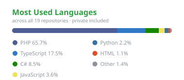

  

  

### 🚀 About Me

🔭 &nbsp;I'm currently working on **Paxis for Paximum** — a B2B travel operations platform  
🌱 &nbsp;I'm currently learning **Next.js + NestJS**  
⚡ &nbsp;Side project: **Jarvis** — a personal voice assistant (Python, Svelte, Tauri)  
💬 &nbsp;Ask me about **PHP**  
📫 &nbsp;Reach me at **ccalperaslan@gmail.com**

### 🧰 What I'm Building

| Project | What it is | Stack |
|---|---|---|
| **Paxis** @ Paximum | B2B travel operations & analytics platform | PHP 8, MariaDB, Tailwind, Alpine.js |
| **paxis-next** | Full TypeScript rewrite of Paxis | NestJS, Next.js, PostgreSQL |
| **[forsproject.com](https://forsproject.com)** | Production web platform, end-to-end | .NET (C#), React |
| **[beyzaistudio.com](https://beyzaistudio.com)** | Studio platform, end-to-end | .NET (C#), React |
| **Jarvis** | Personal voice assistant (Turkish STT/LLM/TTS) | Python, Svelte, Tauri 2 |

### 🛠️ Tech Stack

  
  
  
  
  
  
  
  
  
  
  
  
  
  
  
  
  
  
  
  
  
  
  

### 🔗 Connect With Me

  
  

### 📊 GitHub Stats

  
  

### 📈 Contribution Graph

  

### 💭 Dev Quote

  

---

<i>⭐️ From <a href="https://github.com/alperaslan">alperaslan</a></i>

